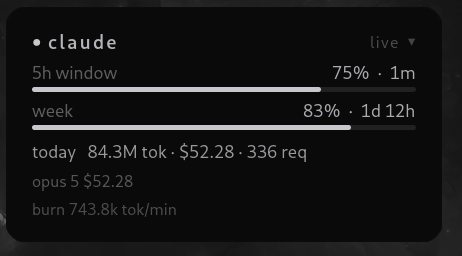
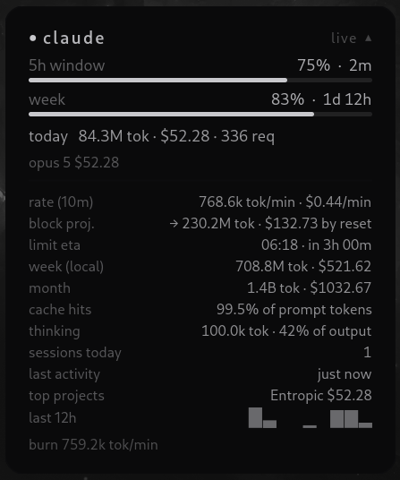

# Klepsydra

κλεψύδρα · the water clock, the allotted time draining.

**Your Claude usage on the desktop, read off your own machine.**

<p align="center">
  
</p>

A small card that sits on the desktop and says where you are in the rolling
five-hour window, what the day has cost, and how fast the current session is
spending. The Athenian water clock timed a speech by letting the water out;
this one does the same for a rate limit, which is the only reason to have it in
view rather than behind a command.

It reads Claude Code's own logs on disk and works the rest out itself. In
default mode it opens no connection to anything. About six hundred lines of
plain Python and Debian's own GTK4 bindings, with no third-party dependencies,
so the whole of it can be read in one sitting.

## Using it

| | |
| --- | --- |
| **Drag** | Moves the card. Where you leave it is where it comes back |
| **Click** | Opens the detail panel, and closes it again. Rows with nothing to report hide themselves, so the panel stays as short as the day was |
| **Middle-click** | Next theme. `Shift`+scroll steps through them in either direction |
| **Ctrl**+scroll | Zoom, in steps of 5% |
| **Right-click** | The menu: details, theme, reset zoom, quit |

Every gesture writes its result back to `~/.config/klepsydra/config.ini`, so
the card you arrange is the card that starts next time.

## What it is telling you

| Reading | |
| --- | --- |
| **5h window** | Where you are in the rolling five-hour limit, and how long until it resets. On its own the widget estimates this against your own median session; under `--limits` it is the official figure |
| **week** | Seven days of usage, with a separate note once the weekly Opus quota passes half |
| **today** | Tokens, computed cost and request count since local midnight, split by model |
| **burn rate** | Tokens a minute in the session that is running, which is where a heavy agent run shows up as it happens rather than afterwards |

The detail panel adds the arithmetic on top of that: the ten-minute rate, where
the current block lands if the rate holds, and an eta for the limit itself.
Then week and month totals, cache reads as a share of prompt tokens, thinking
tokens as a share of output, sessions and last activity, a twelve-hour
sparkline, and the day's cost split by the project directory it came from.
Under `--limits` it also carries subagent and web search usage, and whatever
extra-usage credit is left.

<p align="center">
  
</p>

## What it reads, and what it does not

Default mode makes no network connection at all. It only reads Claude Code's
logs, `~/.claude/projects/**/*.jsonl`, the newer `~/.config/claude/projects/`
location of the same, and `$CLAUDE_CONFIG_DIR/projects/` if you have moved
them. It writes nothing outside its own config file and install directory,
executes nothing, and reports nothing anywhere. Both claims are cheap to check:

```bash
grep -rn "urllib\|socket\|http\|requests" klepsydra/   # network lives only in limits.py
strace -f -e trace=network klepsydra                   # empty in default mode
```

`--limits` opts into exactly one request, `GET
https://api.anthropic.com/api/oauth/usage`, which is the endpoint Claude Code's
own `/usage` calls. It authenticates with the token Claude Code has already
stored in `~/.claude/.credentials.json`, read and never written, and sent to
Anthropic and nowhere else. The hostname is pinned in `limits.py`. The token is
deliberately never refreshed or rotated: when it expires the card says so and
falls back to its own estimates until you next use Claude Code.

The logs are the limit of what can be known locally. They hold Claude Code and
nothing else, so a conversation on claude.ai spends the same allowance without
appearing here, which is the whole of what `--limits` is for. Cost is computed
from tokens against the published per-MTok prices, kept as a table in
`collector.py` and worth updating there when they move. The five-hour block is
reconstructed the way ccusage does it, floored to the hour and started afresh
after a gap of five, which is what the observed resets look like. Streamed
lines that arrive twice are counted once, by `message.id:requestId`.

## Themes

Twenty palettes. `midnight` is the default, beside `nord`, `dracula`,
`gruvbox`, `catppuccin`, `tokyo-night`, `solarized-dark`, `rose-pine`,
`everforest` and `terminal`, with `paper` and `solarized-light` for a light
desktop. `theme = auto` follows GNOME's own light and dark preference.

Eight more come from [Keraunos](https://github.com/corvardt/Keraunos), whose
map is drawn as an instrument readout rather than as an interface. Both of its
media are here: `tube`, phosphor emitted on black, and `chart`, ink laid on a
chart recorder's cool grey roll. `phosphor-green` (P1, the oscilloscope),
`phosphor-amber` (P3) and `phosphor-ice` tint the tube by multiplying its
neutrals against a ratio normalised on its own luminance, so the hue moves and
the weight does not. `crimson`, `demon` and `oil` are borrowed schemes
([WildLeoKnight](https://lospec.com/palette-list/crimson),
[Chicknhawk](https://lospec.com/palette-list/blood-demon-rx) and
[GrafxKid](https://lospec.com/palette-list/oil-6)).

Those eight are ramps rather than traffic lights. With no red to escalate into,
a filling meter climbs the palette's own rungs toward the colour Keraunos keeps
for a strike; on `chart` it runs the other way and a full meter goes black.

```bash
klepsydra --list-themes      # print them all
klepsydra --theme nord       # use one, and keep it
```

Your own is six hex values in `themes.py`: `bg`, `fg`, `border`, and the
`cool`, `warm` and `hot` the meters shift through on the way to a limit.

## Running it

Debian 12 or 13, GNOME.

```bash
sudo apt install python3-gi gir1.2-gtk-4.0   # usually already there on GNOME
git clone https://github.com/corvardt/klepsydra && cd klepsydra
./install.sh              # local only
./install.sh --limits     # with the official percentages
klepsydra
```

The installer copies the package to `~/.local/share/klepsydra`, adds a launcher
and a GNOME autostart entry, and needs root for nothing but the apt line.
`--no-autostart` if you would rather start it yourself.

```bash
git pull && ./install.sh --update    # keeps the flags it was installed with
./install.sh --uninstall             # leaves ~/.config/klepsydra
./install.sh --uninstall --purge     # config as well
```

Each release also ships a `.deb`, built by `tools/make_deb.py` out of the
standard library alone, so producing one needs no `dpkg-dev`. It installs
system-wide and lets apt handle the rest:

```bash
sudo apt install ./klepsydra_*.deb
sudo apt purge klepsydra
```

Take one or the other. They install to different prefixes and share an
autostart filename, so a machine with both starts the `install.sh` copy rather
than two widgets.

To keep it on every workspace under Wayland, focus it and press `Alt+Space`,
then *Always on Visible Workspace*; GNOME remembers that per application. Under
Xorg, `wmctrl -r 'Klepsydra' -b add,sticky,below` pins it below everything
else. Right-click and *Quit* closes it.

## Layout

| Path | Role |
| --- | --- |
| `klepsydra/collector.py` | The logs: finding them, parsing them, dropping duplicates, pricing them, and rebuilding the five-hour blocks |
| `klepsydra/limits.py` | The opt-in official figures, one pinned endpoint and no token refresh |
| `klepsydra/widget.py` | The card itself: the readouts, the detail panel, the gestures, the zoom |
| `klepsydra/config.py` | `~/.config/klepsydra/config.ini`, the only thing the widget writes |
| `klepsydra/themes.py` | The palettes |
| `klepsydra/style.css` | The look. Theme tokens, and pixel values that scale with the zoom |
| `install.sh` | User-level install, update and uninstall |
| `tools/make_deb.py` | Builds the `.deb`, standard library only |
| `tests/` | Stdlib test runners, no pytest |

## Developing

```bash
python3 tests/test_collector.py   # pricing, dedup, five-hour blocks
python3 tests/test_config.py      # config round trip
python3 tools/make_deb.py dist/   # the package
```

CI runs both suites on Python 3.9 and 3.13, builds the `.deb`, and parses every
theme's CSS under GTK4. No third-party dependencies, please: auditable in one
sitting is the point of the thing.
