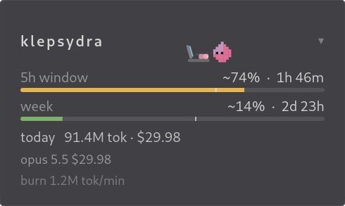
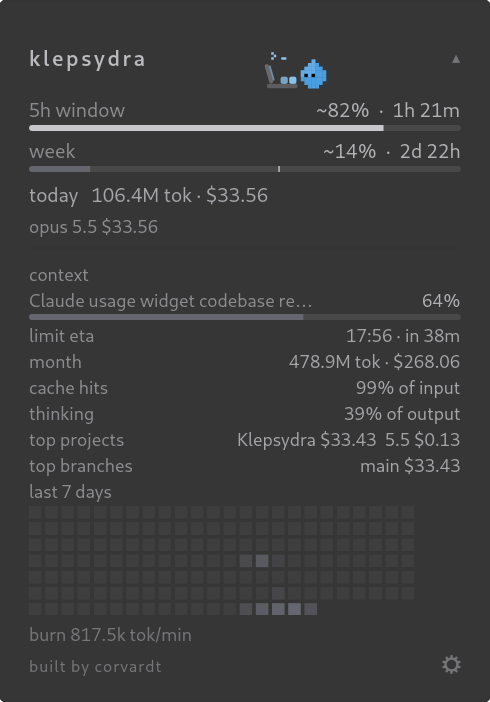
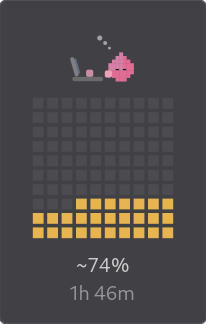

# Klepsydra

κλεψύδρα: the water clock of ancient Greece, used to time speeches.

**A small desktop widget that shows your Claude Code usage, read from your own machine.**

<p align="center">
  
</p>

Klepsydra sits on your GNOME desktop and tells you:

- how much of the 5-hour limit you have used, and when it resets
- how much of the weekly limit you have used
- what today, and this month, have cost
- how fast you are using tokens right now

It works by reading the logs Claude Code already writes to disk. By default it
makes no network connection at all. It is about three thousand lines of plain
Python on top of Debian's GTK4 bindings, with no third-party dependencies, so
you can read the whole thing.

## Controls

| Action | Effect |
| --- | --- |
| **Drag** | Move the card. It reopens where you left it (X11 and XWayland only, see below) |
| **Click** | Show or hide the detail panel |
| **Ctrl**+click | Switch to mini mode and back |
| **Middle-click** | Next theme. **Shift**+scroll goes through themes in either direction |
| **Ctrl**+scroll | Zoom in or out, in 5% steps |
| **Right-click** | The window menu, for *Always on Top* and the like |
| **Click the droplet** | It bounces |
| **Gear** (bottom of the detail panel) | Open `config.ini` in your text editor |

Every change is saved to `~/.config/klepsydra/config.ini`, so the widget starts
the way you left it. The file also has settings with no control on the card,
such as hiding sections, turning off notifications, or hiding the mascot.
Edits apply as soon as you save the file, except the `[network]` and
`[refresh]` settings, which apply on the next start.

Wayland does not let an application choose where its own window goes. The
widget therefore asks for the X11 backend first (XWayland counts) and falls
back to Wayland when there is no X server. On pure Wayland it still works, but
the desktop decides where the card appears.

## What it shows

| Row | Meaning |
| --- | --- |
| **5h window** | How much of the rolling 5-hour limit you have used, and the time until it resets |
| **week** | How much of the weekly limit you have used, with the bar split by model. Opus gets its own note once its weekly quota passes 50% |
| **today** | Tokens and cost since local midnight, then the cost per model |
| **burn** | Tokens per minute over the last ten minutes |

The thin tick on each bar marks how much of that window has already passed.
If the fill is ahead of the tick, you are using the limit faster than the
clock is running out. Bars turn from green to yellow at 70% and red at 90%.

Where the percentages come from depends on the mode:

- **With `--limits`**, they are Anthropic's official figures, fetched every
  five minutes. Between fetches the widget adds what you have spent since, and
  marks the figure with `~`.
- **Without it**, the 5-hour figure is an estimate. The widget compares the
  current window's cost against a reference: the spend at your most recent
  logged limit refusal if there is one, otherwise your most expensive
  finished 5-hour window of the last 30 days. The week then shows tokens and
  cost instead of a percentage.

<p align="center">
  
</p>

Clicking the card opens the detail panel:

- **context**: how full each live session's context window is
- **limit eta**: when you will hit the 5-hour limit at the current pace
- **month**: tokens and cost since the first of the month
- **cache hits**: the share of today's input read from the prompt cache
- **thinking**: the share of today's output spent on thinking
- **background**: the share of today's cost from background jobs
- **top projects** and **top branches**: today's cost by project and git branch
- **web searches**: today's count and cost
- **extra credits**: remaining extra-usage credit (with `--limits`)
- **last 7 days**: a heatmap of cost by hour, today at the bottom

Rows with nothing to report are hidden.

The widget also sends a desktop notification when a window passes 70% and 90%,
and when a window that had warned you resets. Set `notifications = false` in
the config to turn them off.

## Mini mode

<p align="center">
  
</p>

**Ctrl**+click shrinks the card to just the 5-hour window, drawn as a 10×10
grid with one cell per percent. A cell disappears for each percent you use,
shaking just before it goes. When the window is used up, the empty grid shows
a padlock until it resets.

## The droplet

The little water drop in the header shows what Claude Code is doing right now.
It reads this from the logs as they are written:

| Claude Code is... | The droplet... |
| --- | --- |
| thinking | rests its chin on a hand, with a thought bubble |
| writing a reply | types |
| editing a file | slams Enter |
| running a shell command | leans in and watches a `>_` on the screen |
| reading or searching files | scans the screen |
| searching the web | shades its eyes, with a globe beside it |
| running a subagent | drums its fingers beside a small ghost droplet |
| waiting for you (a question, a plan, or a permission prompt) | puts its hands on its hips, with a "?" |
| hitting an API error | jumps, then crosses its arms under a cloud |
| done | throws the laptop away and rocks in a rocking chair |
| idle for 5 minutes | falls asleep |

It also shrugs when you interrupt Claude, glances up when you queue a message,
sweats past 90%, and freezes in a block of ice at 100%. Its colour follows the
5-hour level, and its eyes follow your pointer. To hide it, set
`mascot = false` in the config.

Two limits on this: the logs record nothing while the model is generating, so
thinking and writing can only be told apart roughly; and permission prompts
are not logged at all, so "waiting for you" is inferred when a normally quick
tool takes more than three seconds.

## Privacy and network use

By default the widget makes no network connections. It reads Claude Code's
logs from `~/.claude/projects/`, `~/.config/claude/projects/`, and
`$CLAUDE_CONFIG_DIR/projects/` if that is set. It writes only its own config
file (and, with `--limits`, a small cache of the last response). You can check
both claims:

```bash
grep -rn "urllib\|socket\|http\|requests" klepsydra/   # network code is only in limits.py
strace -f -e trace=network klepsydra                   # prints nothing in default mode
```

`--limits` turns on a single request, `GET https://api.anthropic.com/api/oauth/usage`,
the same one Claude Code's `/usage` command makes. It sends the OAuth token
Claude Code has stored in `~/.claude/.credentials.json`, to Anthropic only.
The widget never writes that file and never refreshes the token: when the
token expires, the widget says so and falls back to its estimates until you
use Claude Code again.

That endpoint is undocumented. Anthropic may change or remove it, and using it
from a tool other than Claude Code may fall outside their terms. That is why
`--limits` is off by default, and the widget works fully without it.

What the logs cannot tell you:

- **Other clients.** Usage on claude.ai counts against the same limits but is
  not in Claude Code's logs. Only `--limits` includes it.
- **Exact cost.** Cost is calculated from token counts and the published
  per-million-token prices in `collector.py`. Update that table when prices
  change.

## Themes

Twenty themes. `midnight` is the default. The others are `nord`, `dracula`,
`gruvbox`, `catppuccin`, `tokyo-night`, `solarized-dark`, `rose-pine`,
`everforest` and `terminal`, plus the light themes `paper` and
`solarized-light`. `theme = auto` follows GNOME's light or dark setting.

Eight more come from [Keraunos](https://github.com/corvardt/Keraunos): `tube`,
`phosphor-green`, `phosphor-amber` and `phosphor-ice` (old CRT screens),
`chart` (ink on grey paper, light), and `crimson`, `demon` and `oil` (palettes
by [WildLeoKnight](https://lospec.com/palette-list/crimson),
[Chicknhawk](https://lospec.com/palette-list/blood-demon-rx) and
[GrafxKid](https://lospec.com/palette-list/oil-6)). These use shades of one
colour instead of green, yellow and red, so a full bar gets brighter, or on
`chart`, darker.

```bash
klepsydra --list-themes      # list all themes
klepsydra --theme nord       # switch theme and remember it
```

To add your own, add an entry to `themes.py` with six colours: `bg`, `fg`,
`border`, and `cool`, `warm` and `hot` for the bar levels.

## Install

Requires Debian 12 or 13 with GNOME.

```bash
sudo apt install python3-gi gir1.2-gtk-4.0   # usually already installed on GNOME
git clone https://github.com/corvardt/klepsydra && cd klepsydra
./install.sh              # default: no network
./install.sh --limits     # with official percentages
klepsydra
```

The installer copies the widget to `~/.local/share/klepsydra` and adds a
launcher and a GNOME autostart entry. Only the apt line needs root. Add
`--no-autostart` to skip the autostart entry.

```bash
git pull && ./install.sh --update    # update, keeping your install options
./install.sh --uninstall             # remove, keeping ~/.config/klepsydra
./install.sh --uninstall --purge     # remove the config too
```

Each release also has a `.deb` on the
[releases page](https://github.com/corvardt/klepsydra/releases). It installs
system-wide:

```bash
sudo apt install ./klepsydra_*.deb    # install, or update to a newer .deb
sudo apt purge klepsydra              # remove
```

Use one method or the other, not both. They share an autostart file, so with
both installed only the `install.sh` copy starts.

To show the widget on every workspace under Wayland, focus it, press
`Alt+Space` and choose *Always on Visible Workspace*. Under Xorg,
`wmctrl -r 'Klepsydra' -b add,sticky,below` keeps it on every workspace, below
other windows. Right-click and *Quit* closes it.

## Code layout

| Path | Contents |
| --- | --- |
| `klepsydra/collector.py` | Finds and parses the logs, removes duplicates, calculates costs, rebuilds the 5-hour windows, tracks what Claude Code is doing |
| `klepsydra/limits.py` | The optional official-limits request |
| `klepsydra/widget.py` | The card, the detail panel, mini mode, the droplet and the controls |
| `klepsydra/config.py` | Reads and writes `~/.config/klepsydra/config.ini` |
| `klepsydra/themes.py` | The themes |
| `klepsydra/style.css` | Styling; every pixel value scales with the zoom |
| `install.sh` | Install, update and uninstall for the current user |
| `tools/make_deb.py` | Builds the `.deb` using only the standard library |
| `tests/` | Tests, run as plain scripts (no pytest) |

## Development

```bash
python3 tests/test_collector.py   # log parsing, pricing, 5-hour windows, live state
python3 tests/test_config.py      # config file reading and writing
python3 tests/test_limits.py      # the official-limits request and backoff
python3 tools/make_deb.py dist/   # build the .deb
```

CI runs the tests on Python 3.9 and 3.13, builds the `.deb`, and checks that
every theme's CSS loads in GTK4. Please don't add third-party dependencies:
keeping the code small enough to read is the point.

## Licence

[MIT](LICENSE). The repository contains no bundled or third-party code, and
depends only on Python, GTK4 and Debian's GTK bindings.

Klepsydra is an unofficial tool, not affiliated with or endorsed by Anthropic.
"Claude" and "Claude Code" are Anthropic trademarks, used here only to say what
the widget reads. The prices in `collector.py` are copied from Anthropic's
published pricing and can go out of date; the widget's costs are estimates,
and Anthropic's own figures are the ones that count.
